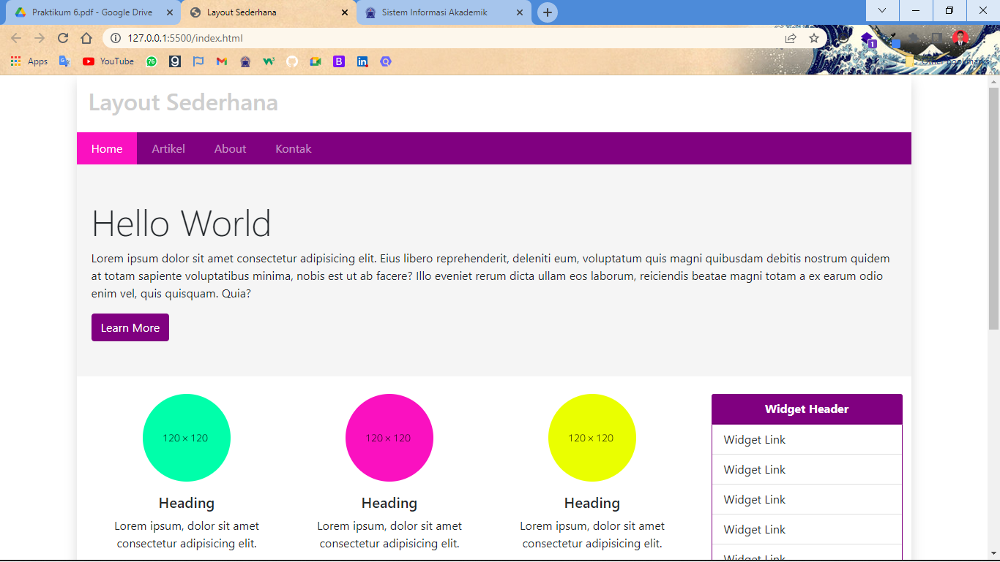
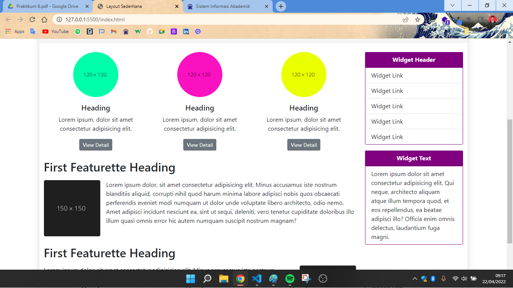
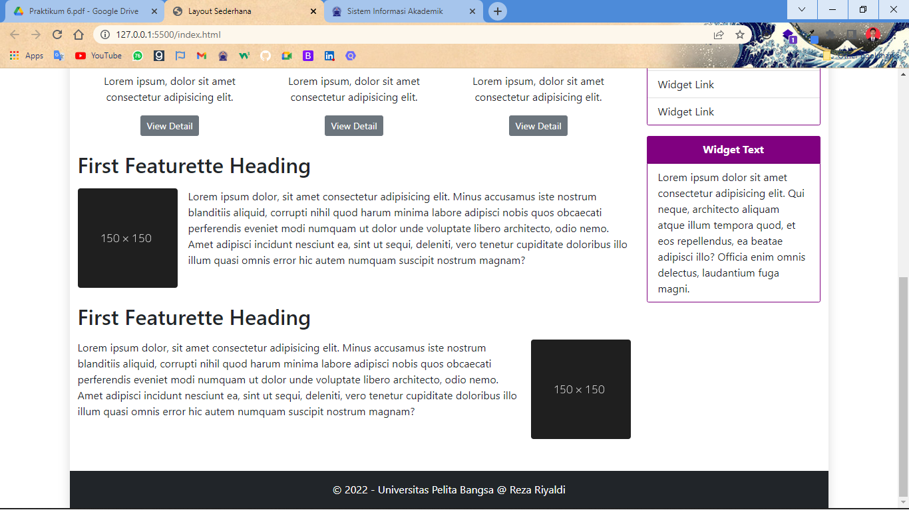

# Tugas Lab 6 Web
## Profil
| # | Biodata |
| -------- | --- |
| **Nama** | Reza Riyaldi Irawan |
| **NIM** | 312010284 |
| **Kelas** | TI.20.A.2 |
| **Mata Kuliah** | Pemrograman Web |

## Langkah 1 `Instalasi Bootstrap`
1. Kunjungi website resmi Bootstrap di [Booststrap.com](https://getbootstrap.com).
2. Download boostrap atau menggunakan CDN untuk memasang bootstrap, _disini saya akan mendownload_.
3. Ekstrak file bootstrap yang sudah di download tadi, pindahkan folder css dan js ke dalam folder project `Lab6Web`.
4. Buat file html dengan nama `index.html`.
5. Tambahkan kode struktur dasar html.

```html
<!DOCTYPE html>
<html lang="en">
<head>
    <meta charset="UTF-8">
    <meta http-equiv="X-UA-Compatible" content="IE=edge">
    <meta name="viewport" content="width=device-width, initial-scale=1.0">
    <title>Layout Sederhana</title>
</head>
<body>
    
</body>
</html>
```

6. Kemudian tambahkan bootstrap kedalam kodingan tersebut, dengan membind file css dan js.
7. Tambahkan css bootstrap didalam tag `<head>`.

```html
<!-- Components CSS -->
<link rel="stylesheet" href="css/bootstrap.min.css">
<link rel="stylesheet" href="css/style.css">
```

8. Tambahkan js bootstrap di dalam tag `<body>` dipaling bawah sebelum penutup.

```html
<!-- Components JS-->
<script src="js/bootstrap.min.js"></script>
```

## Langkah 2 `Membuat Layout Sederhana Menggunakan Bootstrap`
1. Tambahkan kodingan didalam file `index.html` tersebut.

```html
<!doctype html>
<html lang="en">

<head>
    <!-- Required meta tags -->
    <meta charset="utf-8">
    <meta name="viewport" content="width=device-width, initial-scale=1">

    <!-- Bootstrap CSS -->
    <link rel="stylesheet" href="css/bootstrap.min.css">

    <!-- My CSS -->
    <link rel="stylesheet" href="css/style.css">

    <title>Layout Sederhana</title>
</head>

<body>
    <div class="container shadow p-0">
        <div class="judul p-3">
            <h2 style="color: rgb(206, 206, 206);">Layout Sederhana</h2>
        </div>

        <nav class="navbar navbar-expand-lg navbar-dark p-0" style="background-color: purple;">
            <div class="container p-0">
                <button class="navbar-toggler ms-auto m-1" type="button" data-bs-toggle="collapse"
                    data-bs-target="#navbarNav" aria-controls="navbarNav" aria-expanded="false"
                    aria-label="Toggle navigation">
                    <span class="navbar-toggler-icon"></span>
                </button>
                <div class="collapse navbar-collapse" id="navbarNav">
                    <ul class="navbar-nav">
                        <li class="nav-item">
                            <a class="nav-link active" href="#">Home</a>
                        </li>
                        <li class="nav-item">
                            <a class="nav-link" href="#">Artikel</a>
                        </li>
                        <li class="nav-item">
                            <a class="nav-link" href="#">About</a>
                        </li>
                        <li class="nav-item">
                            <a class="nav-link" href="#">Kontak</a>
                        </li>
                    </ul>
                </div>
            </div>
        </nav>

        <div class="banner py-5">
            <h1 class="fw-light">Hello World</h1>
            <p>Lorem ipsum dolor sit amet consectetur adipisicing elit. Eius libero reprehenderit, deleniti eum,
                voluptatum quis magni quibusdam debitis nostrum quidem at totam sapiente voluptatibus minima, nobis est
                ut ab facere? Illo eveniet rerum dicta ullam eos laborum, reiciendis beatae magni totam a ex earum odio
                enim vel, quis quisquam. Quia?</p>
            <a href="#" class="btn" style="background-color: purple; color: white;">Learn More</a>
        </div>

        <div class="row m-0 my-4">
            <div class="col-md-9">
                <div class="row m-0">
                    <div class="col-md-4 text-center mb-4">
                        
                        <h5>Heading</h5>
                        <p>Lorem ipsum, dolor sit amet consectetur adipisicing elit.</p>
                        <button class="btn btn-secondary btn-sm">View Detail</button>
                    </div>

                    <div class="col-md-4 text-center mb-4">
                        
                        <h5>Heading</h5>
                        <p>Lorem ipsum, dolor sit amet consectetur adipisicing elit.</p>
                        <button class="btn btn-secondary btn-sm">View Detail</button>
                    </div>

                    <div class="col-md-4 text-center mb-4">
                        
                        <h5>Heading</h5>
                        <p>Lorem ipsum, dolor sit amet consectetur adipisicing elit.</p>
                        <button class="btn btn-secondary btn-sm">View Detail</button>
                    </div>
                </div>

                <div class="my-4">
                    <h2 class="mb-3">First Featurette Heading</h2>
                    <div class="d-flex">
                        
                        <p>Lorem ipsum dolor, sit amet consectetur adipisicing elit. Minus accusamus iste nostrum
                            blanditiis aliquid, corrupti nihil quod harum minima labore adipisci nobis quos obcaecati
                            perferendis eveniet modi numquam ut dolor unde voluptate libero architecto, odio nemo. Amet
                            adipisci incidunt nesciunt ea, sint ut sequi, deleniti, vero tenetur cupiditate doloribus
                            illo illum quasi omnis error hic autem numquam suscipit nostrum magnam?</p>
                    </div>
                </div>

                <div class="my-4">
                    <h2 class="mb-3">First Featurette Heading</h2>
                    <div class="d-flex">
                        <p>Lorem ipsum dolor, sit amet consectetur adipisicing elit. Minus accusamus iste nostrum
                            blanditiis aliquid, corrupti nihil quod harum minima labore adipisci nobis quos obcaecati
                            perferendis eveniet modi numquam ut dolor unde voluptate libero architecto, odio nemo. Amet
                            adipisci incidunt nesciunt ea, sint ut sequi, deleniti, vero tenetur cupiditate doloribus
                            illo illum quasi omnis error hic autem numquam suscipit nostrum magnam?</p>
                        
                    </div>
                </div>
            </div>

            <div class="col-md-3">
                <!-- Widget 1 -->
                <div class="card border-0 mb-3">
                    <div class="card-header text-center fw-bolder" style="background-color: purple; color: white;">
                        Widget Header
                    </div>
                    <ul class="list-group list-group-flush" style="border: 1px solid purple;">
                        <li class="list-group-item">Widget Link</li>
                        <li class="list-group-item">Widget Link</li>
                        <li class="list-group-item">Widget Link</li>
                        <li class="list-group-item">Widget Link</li>
                        <li class="list-group-item">Widget Link</li>
                    </ul>
                </div>

                <!-- Widget 2 -->
                <div class="card border-0">
                    <div class="card-header text-center fw-bolder" style="background-color: purple; color: white;">
                        Widget Text
                    </div>
                    <ul class="list-group list-group-flush" style="border: 1px solid purple;">
                        <li class="list-group-item">
                            Lorem ipsum dolor sit amet consectetur adipisicing elit. Qui neque, architecto aliquam atque
                            illum tempora quod, et eos repellendus, ea beatae adipisci illo? Officia enim omnis
                            delectus, laudantium fuga magni.
                        </li>
                    </ul>
                </div>
            </div>
        </div>


        <footer class="bg-dark text-white p-3 text-center">
            <p class="m-0">&copy; 2022 - Universitas Pelita Bangsa @ Reza Riyaldi</p>
        </footer>
    </div>


    <script src="js/bootstrap.min.js"></script>
</body>

</html>
```

2. Tambahkan file css dengan nama `style.css` di dalam folder css, lalu berikan code berikut.

```css
/* Navigasi */
ul li a {
    padding: 10px 20px !important;
}

a.active, a.nav-link:hover {
    background-color: #fa11c0;
}


/* Banner */
.banner {
    padding-left: 20px;
    padding-right: 20px;
    background-color: rgb(245, 245, 245);
}

.banner h1 {
    font-size: 50px;
}
```

3. Maka hasilnya akan seperti berikut.





